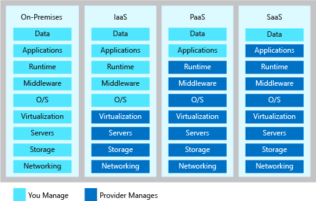
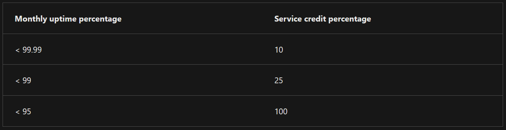
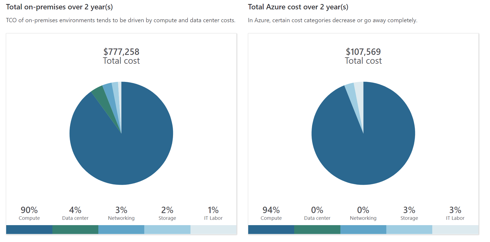
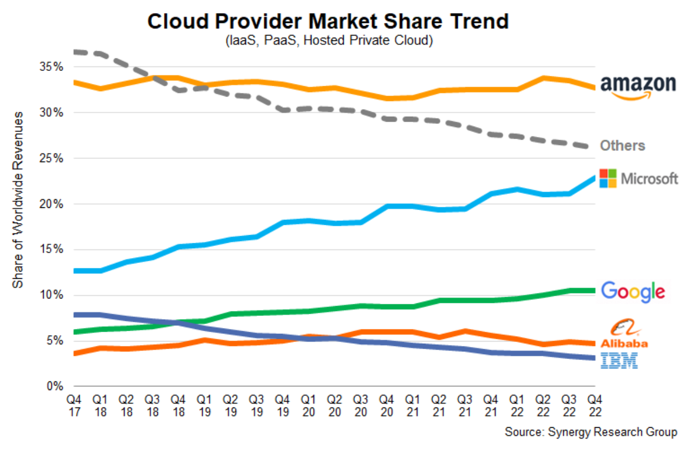
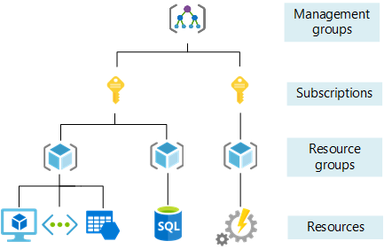
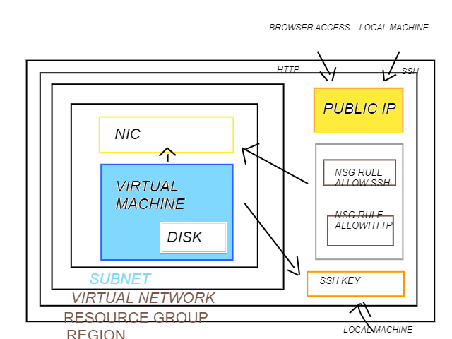

# What is cloud?

Cloud computing, often referred to as simply "the cloud," is a model for delivering computing resources over the internet on-demand. Instead of relying on local servers or personal computers to store and process data, cloud computing allows users to access and use shared computing resources provided by a third-party provider.
On-premises: office or branch
in the cloud: Microsoft-owned (Azure) internet
In cloud means resources are delivered as a service On-demand on the internet
Data centres in cloud have own water supplies, power generators, own networking. They are resilient and more reliable. Data centres from cloud provider can be in some distance from each other.

### Benefits of using clouds:
* Protection and security
* Huge capacity and storage (enormous computing power) but still economic
* Reliable, they can keep power by generators and batteries powers but still sustainable.

Renting a dedicated server

* Public cloud –> multiple occupant cloud – sharing a server, not dedicated one. We don’t know who else running VM on that server. 
* Private cloud -> Single tenant cloud – Cloud infrastructure dedicated to a private company. Can be owned or hoster by 3rd party company.  Can be used when there is no internet access.
* Hybrid cloud -> Combination of on-premises and on the cloud mixed together. Database run on premises and web app running in the cloud (Azure). Web app connected to a database that is on-prem.

* Multi-cloud -> Different cloud providers for example use of Azure and AWS.

Types of Cloud Services: IaaS, PaaS, SaaS

On premises you are in control and have to manage everything:

* IaaS – Infrastructure as a Service
* PaaS – Platform as a Service
* SaaS – Software as a Service

 

SaaS – e.g Office 365, Dropbox etc.
PaaS – You designed web application and you don’t have to worry about anything else but deploying your code.
IaaS – VM, running a virtual machine

### Advantages and disadvantages of cloud:
* Advantages:
-	Scalability – if you need more computing resources it can almost automatically happen. Rapid adaptations
-	Cost Efficiency
-	Accessibility and Mobility – can be access from anywhere
-	Automatic Updates and Maintenance
-	Data Backup
* Disadvantages:
-	Internet Dependency
-	Moving from one provider to another
-	Security concerns
-	Limited control 
* What are the disadvantages of using hybrid or multi-cloud:
-	Complexity - You need to have an expert in every cloud service you use
-	Cost – quite expensive 
-	Data Security and Compliance
-	A lot of maintenance

On-prem or cloud, what is cheaper?
Probably cloud because you pay for what you use and you can predict the costs.

Probably AWS

Azure:

 

If they don’t deliver you can get a credit back. It is almost 100% of what are you paying

Report of cost efficiency from Azure calculator:

  

Big 3: AWS, Azure (Microsoft),  Google

 

Microsoft is doing good because of the integration. A lot of businesses use it. They own a whole ecosystem. 

### What is Azure?

 
Above Management groups – root (in Azure / Azure Active Directory Tenet)

Management Group – helps you to manage access, policy and compliance of many subscriptions. way to manage your organisation. For a particular department in a company you might want them to use only specific part of VM. It will help you with cost. You can have 6 levels of it. Management groups of management groups etc..

Subscription – separate payment account, way of separating billing (e.g. sales team in organisation or marketing team). Pay as you go Subscription, Student Subscription in Azure. There are limits and quoters for subscriptions. A subscription can have max of some number of Resource groups.

Resource groups – like containers. You can’t have resource group inside resource group. AWS you don’t have to use Resource groups. In Azure you have to. 

Resources 

### CapEx vs OpEx

CapEx - Capital Expenses / cost up in front, quite expensive e.g if on-prem there is a lot of expenses
OpEx - operational expenses / costs spread during the week, month etc.

### Tags
help keep the bills 

Team: Sales 1 

always key: value

### Categories of Azure services

* database -  proprietary, open-source engines
* AI - machine learning, deploy pre-trained-modem, bot service
* web - APIs, web apps, map services
* big data - complex queries, analytics
* IoT - manage devices, connect
* compute - web apps, VMs, mobile apps
* DevOps - testing, pipelines, boards, repos, artifacts ()
* storage - disk, blob, file, archival
* mobile - apps, notifications
* network - VPN, VNet, load balancer

### 4 ways to acces Azure - portal, CLI, PowerShell, other services/tools

ARM - azure resource manager

Virtual network - Like your house. It is a measure of protection you can set up. The subnet are breaking up this space into rooms.

 way oh housing your resources so they can talk to each other. In a virtual wireless environment.

 ### Single Azure VM

* 1 - *Where everything lives / Region 
* 2 - Like a container to organise everything you have / resource group
* 3 - Like a house - structure / Virtual Network
* 4 - Like a room inside house / Subnet
* 5 - Like a computer device within a room / virtual machine
* 6 - Stores the files for the VM / disk
* 7 - Communicate with the computer through this / Network Interface Controller NIC
* 8 - Your public address / Public IP address
* 9 - like the security system on the computer / network security group NSG
* 10, 11 - rules to decide what types of people (traffic) can access the computer / NSG rule allow SSH allow HTTP
* 12 - Like a padlock on the computer / SSH key

 ### Creating VM in Azure

 1. Creating SSH key

 `$ ssh-keygen -t rsa -b 4096 -C "kf.dudek@gmail.com"`

 2. Vewing a Public key

 value of the public key we will need to pass later on to SSH keys in Azure

 `$ cat tech241-krzysztof-az-key.pub`

 3. Creating VM in Azure 

* Open a web browser and navigate to the Azure Portal.
* Sign in with your Azure account credentials.
* Click on "Create a resource" in the upper-left corner of the Azure Portal.
* In the search bar, type "Virtual Machine" and select "Virtual Machine" from the search results.
* Click on the "Create" button on the Virtual Machine page.
* Provide the required details for your VM, such as resource group, VM name, region, and availability options.
* In the "Authentication" section, select "SSH public key" as the authentication type.
* Paste the SSH public key that you copied in Step 3 into the "SSH public key" field.
* Complete the remaining steps, such as configuring the disk, networking, and management options, according to your requirements.
* Click on the "Review + create" button to validate your configuration.
* After the validation is successful, click on the "Create" button to create the Virtual Machine.

.png)

4. Accessing Virtual Machine

Once the VM is created, you can access it using SSH and your private key. Here's an example of how to connect via SSH using the private key file:

First add read permissions to your private key

`chmod 400 tech241-krzysztof-az-key`

`ssh -i /path/to/private/key username@public-ip-address`

.png)

5. Stoping, starting and deleting your VM

You can manage your VM from the dashboard

.png)

### Research task

#### What is virtualization?

Virtualization is the process of creating a virtual (rather than physical) version of something, such as an operating system, server, storage device, or network resource. It allows you to run multiple virtual instances of an operating system or applications on a single physical computer or server.

In the context of computer systems, virtualization involves using software to emulate the functions of hardware components or entire systems. This software, known as a hypervisor or virtual machine monitor (VMM), allows the creation and management of virtual machines (VMs).

#### What is VM?

A virtual machine (VM) is a software emulation of a physical computer system. It behaves like a complete computer with an operating system and applications running on it, but it is actually running on a host computer or server.

#### Where they can be run?

* On-prem servers
* Cloud Providers
* Desktop computers (software like VMware)
* Containers (Dockers, Kubernates)

Virtual machines can be run on a wide range of hardware, from small laptops and desktops to large-scale servers and data centers. The choice of platform depends on factors such as performance requirements, scalability needs, and management preferences.

#### What determines how many virtual machines can run?

Several factors determine the number of virtual machines that can run on a given system. These factors include:

* Physical hardware resources - CPU, memory, storage
* Resource allocation - The allocation of resources to each virtual machine affects the number that can run simultaneously.
* Workload demands - The resource requirements of the applications or workloads running on each virtual machine impact the number that can be hosted.

#### What does a virtual machine include?

* Virtual Hardware
* Operating System
* Applications and Software
* Hypervisor - The hypervisor, also known as the virtual machine monitor (VMM), is the software layer that manages the virtual machines.
* Configuration and Settings

#### What software is required to orchestrate/run the virtual machines?

To orchestrate and run virtual machines, you typically need virtualization software or hypervisor softwarelike VMware, Microsoft Hyper-V, Oracle VM VirtualBox

#### What is the importance of an image when creating an VM?

An image plays a crucial role when creating a virtual machine (VM). It serves as a template or blueprint for the VM's initial configuration and contents.
 